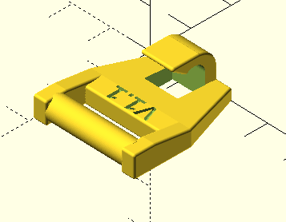
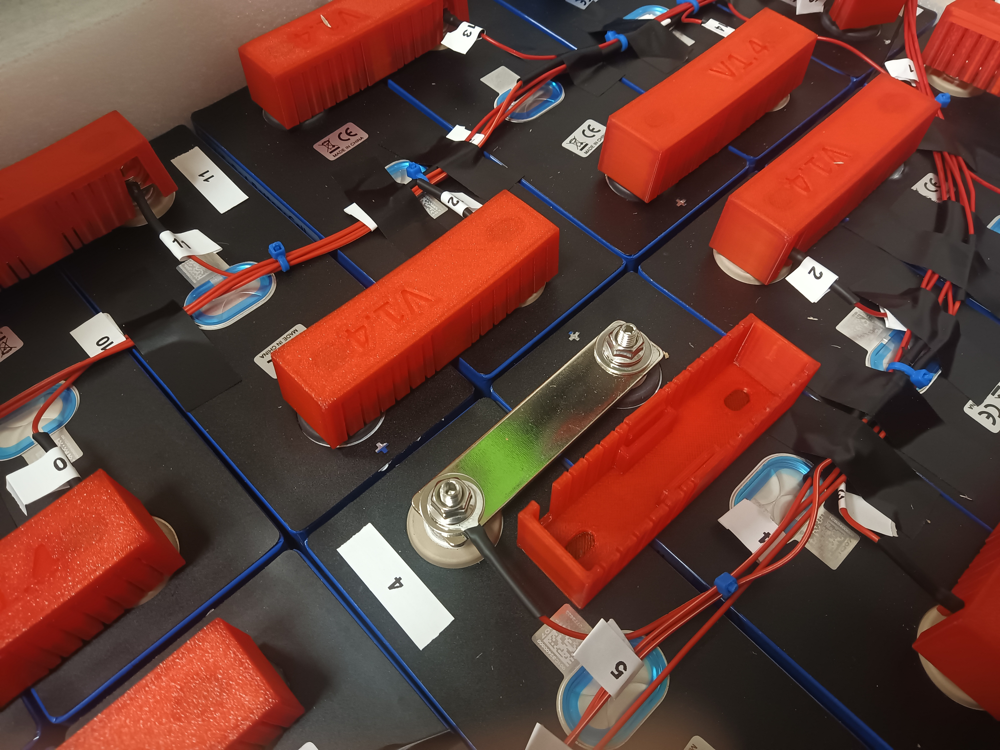
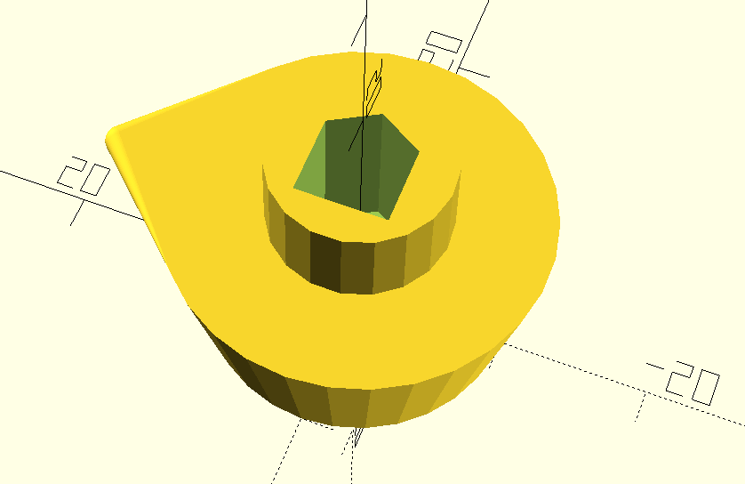
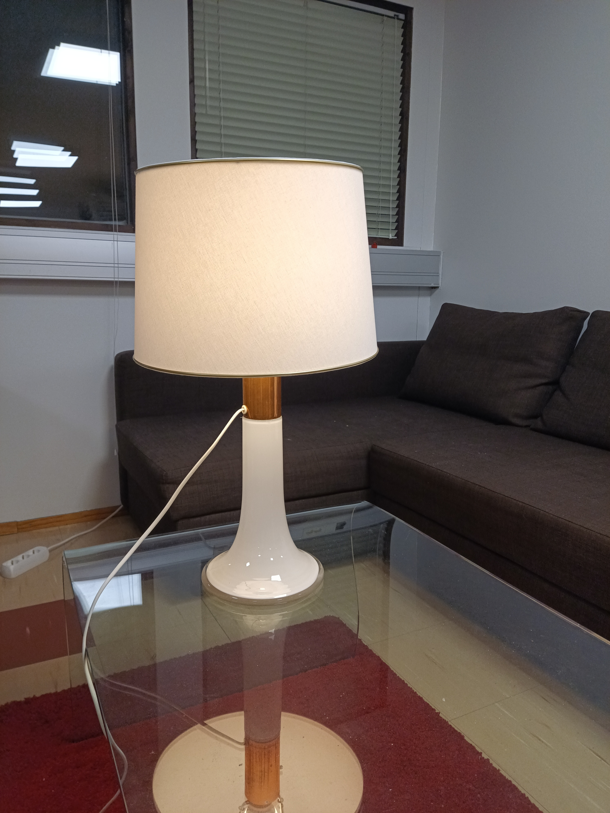
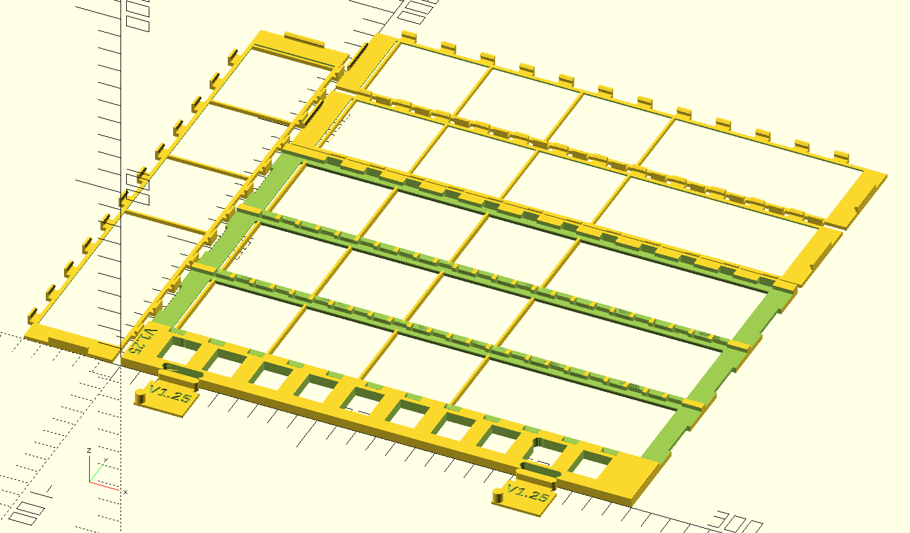
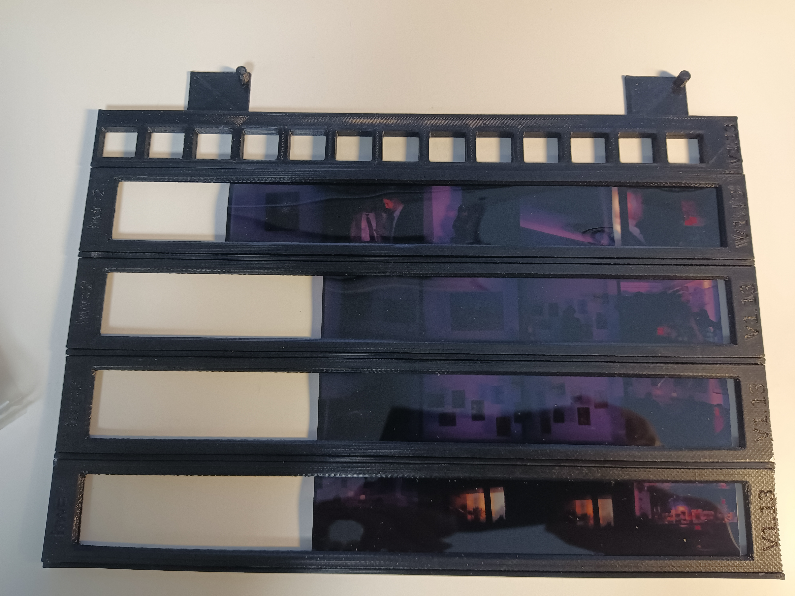
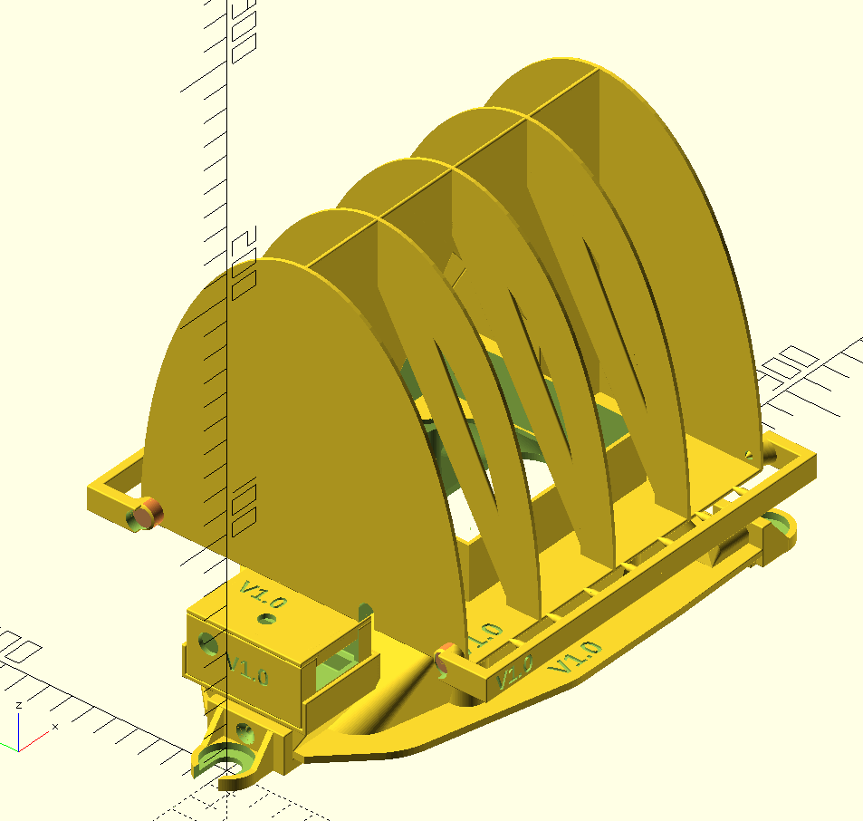
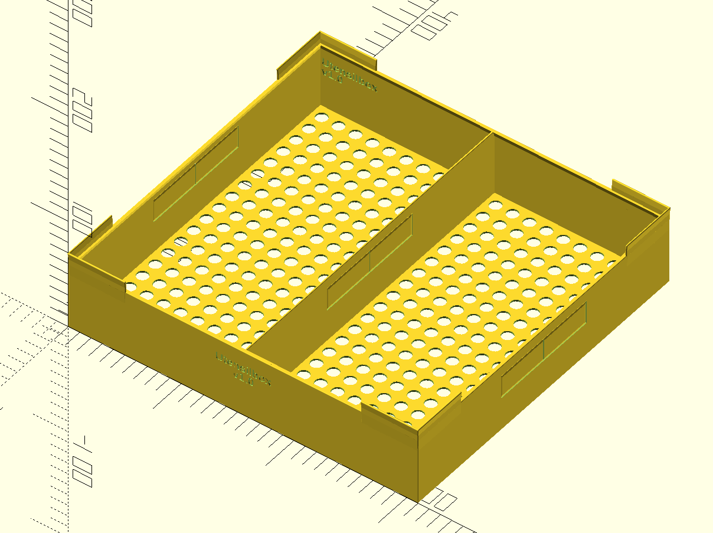

# Various open source physical objects by Heikki Suonsivu

These are licensed, unless otherwise stated in program files or included license text,
under [Creative Commons CC-BY-NC-SA](https://creativecommons.org/licenses/by-nc-sa/4.0/).

I mostly use OpenSCAD for modeling, it will export STL. As I use
hull() a lot, these might be difficult to import to other cad
programs. Some of the models are really slow in OpenSCAD, so use F6
(or whatever in your computer) to render before changing viewing angle.

Please return improvements to me to be included in the
main distribution.

I usually try to avoid needing supports by making angles less than 50
degrees or overhangs small enough, so unless otherwise stated, you can
print without supports,if the object is rotated correctly in the slicer.

### canon-tripod-1-top.scad

I had old Canon tripod-1, and its rubbery top part disintegrated with
age. This is a replacement. Print with TPU.

### coasterholder3.scad

If you have a dead 5.25inch hard drive, you can recycle the disk
platters inside to make nice coasters for you bar. This is a holder
for coasters from a 8 platter Maxtor hard disk. Other hard disks might
need some adapting. See also "suklaarasiankansi.scad".

### disk525to35.scad

This is an adapter to put 3.5 inch disk drive to a 5.25 drive slot. It
is designed to not to need screws, however, with certain cases that
might not work well due to funky mechanisms to lock things in
place. Maybe fixed in a future versions to allow screws to be used for
outside attachments.

printing time on Tronxy X5SA/Pro 400 or Anycubic Chiron takes about 18
hours, and uses about 200g of filament. No supports are needed, rotate
so that locking sticks are on the bed, and on moving bed printers bed
moves in direction of locking sticks to avoid falling over.

To save filament and printing time, default is to make the thing with
various cutouts.

Locking mechanism uses locking sticks, when pushed in, they push
knobs/keys into drive/case screw holes. For outer screw holes, you can
put the stick in upper or lower position, as computer cases might
have different screw positions.

If you enable simple version, there is no locking
mechanism, and the adapter only locks with springs. This does not
keep things in place very well.

Full height 3.5 inch drives will not fit as they are same height as
5.25 slot. Those are very rare anyway. Maybe this could be adapted by
removing top and bottom from disk position.

This makes openscad very slow, so render (F6) first before rotating or
zooming.

See options in the file.

### hammasharjateline.scad

Organizer for various things in the bathroom. Very specific, so not
very usable unless you use exactly same electric toothbrush and shaver
as me. This can be screwed into a wall.

### license.scad

The default license file.

### lidllaturiteline.scad

Lidl sells wireless phone charger for two phones. It is not very
practical as the mobile phones need to be placed accurately to the
correct position. This holder allows simply dropping the two phones to
the slots, and they will start charging.

This was designed for my Blackview phones. Unfortunately, many phones
seem to have the induction loop at different position. For example,
some phones need to be upside down. It is relatively easy to tune for
various phones, the settings are in top of the files, hopefully
self-explanatory.

### kasvikyltit.scad

Bunch of veggie labels for your garden. You can modify the names at
the start of the file. End the list of labels with "". You can have
several labels printed in one go, but you must put names in order of
longest text to shortest text, I was too lazy to fix the related
bug. It will do 2 labels for each name so you can put a label at both
ends of the row.

I have printed these with light colour at bottom and top, and black in
the middle layers to make text more visible.

This uses recursion as I could not easily figure out how to do loops
which change variables.

We had problems with birds picking up yellow labels and throwing them
around. I have no idea what they were thinking, but yellow might not
be the right color choice. Next summer we will try red and make labels
larger.

### nimikyltit.scad

### Makefile.nimikyltit

Bunch of name labels. These we designed to be put on top of
rack for towels. You can modify the names at the start of the
file. End the list of names with "". You can
have several labels printed in one go. You also need to configure the
size of your printer print area, as it will arrange labels automatically.

Additionally, you can print a holder for name labels to hang to a
wall. This needs to be printed on its side, and it is very narrow
print, so for bedslingers, you need to position the print to direction
of the bed movement and use brim.

I have printed the labels with black at the bottom and lighter color on top
to make text more visible.

The design expects a small gap between wall and rack. We installed
washers behind the rack to add a bit of gap.

This uses recursion as I could not easily figure out how to do loops
which change variables.

### lundiacarrier.scad

Carrying multiple lundia shelf plates is difficult as they tend to
slide over each other. So I made a handle. You need to add two locking
straps ([such
as](https://www.tokmanni.fi/kiinnityshihna-pikalukko-25-mm-2-5-m-2-kpl-6419860608952)). This
is likely useful to carry other stuff as well.

### mittatesti.scad

Calibration tool to measure x,y and z axis. Some printers such as my
Tronxy need x/y axis movements to be calibrated. You can tune Number
of cubes and whether filament- and time-saving holes are printed.
For filaments which tend to warp and deform, this does not work very
well. Use PLA.

### paperiteline.scad

Holder for paper towel rolls. Left and right parts can be printed at
the same time if your printer is large enough. Left and right parts
lock into each other, but currently the mechanism leaves room for
improvement. Slight push releases the "fingers" holding the right
side.

### plantsupport.scad

One of our office plants was about to collapse and needed
support. This is very specific to size of planter and plant.

### presshandle.scad

I built a press for large engineering drawings to iron them
out. Basically it is a table with another table plate on top with
hinges. This is a handle for it. Might be useful for some other
application as well.

### sinisentuolinjalka.scad

One of the chairs in our office was missing a plug in one of its
feet. This is a replacement. Print with TPU with 100% fill. The chair
does not have any label in it so I do not know what brand or type it
is.

### suklaarasiankansi.scad

You can turn your dead 5.25 inch hard disk into a stylish chocolate
box. This is for Maxtor 8 platter drive. Unfortunately, this model
does not work with any other disk model, so you need to find a dead
Maxtor IT-1140 drive. The screws are positioned so that the existing
holes can be used. The screws I used were random picks from my junk
box. There may be some size problems with this one as the printer I
used had calibration problems with x and y axis. Do a test print and
adjust.

### termostaatin-piuhapidike.scad

I needed a holder for smart zigbee thermostat cables for programming
in batch, so a small holder was needed. Not really useful for anything
else.

### vasara.scad

(Project stalled) Thought I needed electric hammer, so started
designing one but found a commercially available product so this project
stalled very early. Maybe some day...

### sipulinistutin.scad

I needed to plant some seeds and onions, and wanted a tool for the job
to avoid stressing my back. This attaches to 25mm diameter metal
tube. When planting stuff, drop seeds from top of the tube while
pulling the sharp edge to open a narrow dig so that the seeds drop to
bottom of it. You need to maintain constant speed and drop seeds at
steady intervals. Or just keep pouring them while pulling
quickly. After planting a row, turn the tool 90 degrees and cover the
dig. Some of the onions turned out to be too large for 25mm tobe, so a
larger version would be needed for larger tubes. However, it worked
with other seeds fine. No supports are needed to print.

### kynnyskulma.scad

If you need to roll heavy wheeled items over a doorstep, this
threshold ramp will help a bit. The model will split the part to
multiple parts which attach to each other, so you need to configure
your printer width. For small printers, you can print the parts in
vertical configuration, but they are more difficult to attach to each
other. For heavy items, you might want to up infill % from
defaults. You can do a small test print to test attachments. No supports are needed to print.

### masklock.scad

A CPAP mask lock replacement. Needs supports, works best with tree
supports.

### batterybarcover.scad

Covers li-ion between battery connector bars. Small openings can be
snapped off to provide holes for BMS cables. Supports two types of
battery bars. No supports are needed to print.

### batteryterminalcover.scad

Covers li-ion battery pack terminals. Small openings can be snapped
off to provide holes for BMS cables. Use a small cable binder to
lock. No supports are needed to print.

### bedcontrollerpart.scad

A plastic part of my bed controller broke, here is a new one. The bed
brand is Tempur and the motor bed seems to be from Germany. No supports are
needed to print.

### doublebedholder.scad

Keeps two normal beds together for double occupancy. Limited
tunability for different beds, distance between feet and feet
diameter/square edge. No supports needed to print.

### rakki-kiinnike.scad

Spare part for rack-mount power strip. Modded original from Tero Kivinen. Can be printed with no supports when vertical, but likely needs a brim. 

### tunturi460wheel.scad

Spare part for Tunturi E460 exercise bike. The original back wheels
intended for easier moving the bike around disintegrate with
time. This is a replacement. I printed these with TPU and 100%
fill. Maybe overkill, less fill might work. When printing with TPU,
you likely need supports option, otherwise TPU may not stick to the
bed. PLA prints without this option, and the part looks more like
original, but that is not really visible as long as you install them
with support side towards the center.

### isonappi.scad

Lost a button of my Ernst Brendler overcoat. This is a copy. Crude,
but close enough. For easier printing, is has support option,
otherwise it will need supports enabled in the slicer.

### mask.scad

Party mask. Fragile and not very flexible.  Copied idea from someone
else, but implemented this myself.  Todo: attachments to glasses,
improved flexibility.

### roboteeth.scad
### Makefile.roboteeth

During halloween you must beware of aggressive robots! This is a set
of teeth and face for UR UR5e cobot with Robotiq Adaptive
Gripper. Needs screws to attach head. The teeth clip into
gripper. Tune down the gripping force to avoid too painful bites.

Use Makefile.roboteeth to generate all needed parts with openscad. No
supports needed.

### powerknob.scad

Our office was missing a knob in electrical cabinet. This is a
spare. More modern style though, but works. No supports needed.

### blanketcontrollerholder.scad

I have an electric heated blanket for cold winter nights. This is a
holder for the controller. Heated blanket is [Nedis from
Tokmanni](https://www.tokmanni.fi/lampopeitto-nedis-180-x-200-cm-5412810334773). Only
works if the bed is next to a wall. Likely fits with other brands of
blankets as well. The model is in 4 parts to allow printing in a small
printer such as ankermake 5C. For some printers with low accuracy, you
might need to increase tolerance to make attachments work. For me,
Ankermake worked, but Anycubic print needed filing. No supports needed.

### tunturie460holder.scad

### Makefile.tunturie460holder

Tablet stand for Tunturi E460 exercise bike to allow browsing the
Internet while exercising. Tablet dimensions taken from an old
iPad. Needs 5 20mm 3.5mm screws (countersink). Use
Makefile.tunturie460holder to generate all needed parts with
openscad. One of the parts is for testing screw if you want to change
screw type, no other use. Top clip should be printed with flexible
material, such as TPU.

If "strong" option is enabled, the model will trick slicer to generate
100% fill around the screwholes, making them stronger. This is useful
if you slice with lightning fill. What it does is generate very thin
concentric voids around the screw holes. Notice that "strong" option
will make the model very slow to process in openscad, and you need to
check that your print settings have "Hole Horizontal Expasion" set to
0.0, otherwise the slicer will expand the voids and reverse the effect
by making the print weaker.

No supports are needed.

### measurementcardcover.scad

A case for Clausal Computing Oy's data acquisition board designed to be
installed in Famatel electrical box. Has openings for most
connectors. Needs one 3.5mm 20mm screw for closing, other edge is closed with clips.

Use print=1 for print model. No supports are needed.

### kaapelipidikkeet.scad

Holder and base for electrical bus bars for Famatel electrical
box. Supports two bus bars, each for 12 cables. The bus bars clip to
the holder and stay in place, but you can secure them with 4mm
countersink 30mm screws for added strength. Allows all electrical box
opening cuts to be used. The bus bars used are intended for DIN rail
installation, but this holder does not use DIN format, instead it fits
the screw base. This may not be of any sort of standard, but neither
is the T supports in the electrical box for which this is designed for.

Use print=1 for print model. No supports are needed.

### lampcork.scad

I have a old design table lamp which had its top loose from the
base. The base is made of glass and upper part made of copper got
loose, and the the upper is screwed through a cork stopper within top
of the glass. The cork self-destructed when we tried to extract it for
fix, so I designed a replacement for the cork part. It needs to be
printed with TPU to get a snug fit for the glass part. The design may
need some improvement, as it is a bit too loose, but that is mostly
the shape and diameter fix. I printed with 50% fill, however, slightly
less dense fill and small increase in diameter might make it better
fit. Transparent TPU95 worked.

The table lamp was designed by Lisa Johansson-Pape, and was
manufactured by Orno, when it was owned by Stockmann. The lampshade
was restored by Varjostinnurkka in Helsinki.

The original screw fits into the slot in the part, so this replaces
the cork, otherwise it is as original.

The model also includes top screw for the lampshade, as I managed to
loose the original in the process. You need a suitable short
countersink screw to insert in the printed top part, use soldering
iron to make it fit snugly, then use suitable glue to fix the cover in
place.

print=1 prints the cork replacement, and print=4 prints the lampshade
screw parts. No supports are needed for printing.

.

.

### filmscanframe.scad
### Makefile.filmscanframe

A frame to scan film strips in a flat bed scanner, for both negatives
and positives. This is designed for Epson Perfection V850 Pro, so it
has Epson's positioning knobs. The positioning knobs are detachable,
as with them the frame is too wide for A4 pocket. To store the frame
turn the epson bits upside down and towards film strips to avoid
losing them.

I am using vuescan to scan the film strips.

The motivation for this was that Epson included a strip frame which
can scan only 3 strips at the time, and it has glass, which can cause
nasty optical errors and adds another optial layer reducing scan
quality, and it is has very smooth surfaces, causing reflections which
show up in pictures. This one has 4 strips, max 6 images each, for
total of 24 images to scan in one go.

This has strip at approximately 2mm over glass, which apparently Epson
is the focus point for this scanner when using film/negative
settings. It does not have focus change tabs like the Epson's own
frame, but when I tried to find the optimal height using Epson's
frame, I could not really see much difference between different
heights. The material I have been scanning is mostly taken with medium
consumer cameras so there are not that many pixels there anyway.

The frames are cheap enough that you can permanently store the strips
in the frame. At the current filament prices they cost approximately 2
euro per piece as printed, using about 100g of filament. I use plastic
binder pockets to store the frames.

The clips and film hole knobs require accurate printer. When using a
new frame, it seems to be better to install covers without film first
to make sure that all clips are ok and there are no strings etc which
would show in the final scan. The film hole knobs are the hardest thing to
get right, as they are small and printers tend to make small towerlike
knobs misshaped. It may be that clips require tuning for various
printers as well.

There are multiple options in the beginning of the file for debugging.

Supports older 46mm wide film type, filmtype 35 is normal film, 46 is the older wide film.
Possible future improvements could be tuning the film hole knobs to more
accurately keep the film positioned and straight. Older films or
negatives are often curved. I did try to use frame separators to make
sure that the film is as flat as possible, but frame separators are not
well standardized for position, and different cameras are not doing
frames identically in relation to film holes.

Originally, I tried to use film hole knobs to snap to the covers, but
this was too unreliable due to misshapen film hole knobs, thus I did
side clips to keep the covers in place.

No supports are needed to print. I use black PLA to print
these. Lighter colours may cause reflections.

### circletemplate.scad

Templates to estimate radius/diameter of a curve. Handy when making a
3d model of an existing part. This can measure both outside and inside
curves.

This needs further development, the parts should have a hole which one
can run a string through to attach all of them together. Also, it
tries to arrange the parts to fit to a bed, but does rather miserable
job doing that.

To make values more visible, you can print bottom and top in different
color, such as black/white, with multicolor printer or by manually
switching filament during printing.

### ruokasuppilo.scad

We had complaints that onion peels are not dropping to the compost bin
when pushed over the edge of the kitchen table above the compost bin,
but float in the air and get outside of the bin. So we needed a
funnel. This very large, requiring 400x400x450 printer to print, and
takes 2-3 days to print.

Still needs some improvements.

### leafbatteryfan.scad
### Makefile.leafbatteryfan

Nissan Leaf has a serious problem with battery temperature management,
which means during winter it is too cold and during summer it is too
warm, limiting capacity and quick charging. The problem is worst
during wintertime when the range is already reduced due to other
effects. The problem becomes much worse if the battery is old and/or
has bad cells. This fan case can be installed to the service hatch
between rear seats, replacing the metal plate normally protecting the
hatch. In the summer this could also help keep battery cooler, though
the effect is likely very limited. While moving, there is not much to
do about the heat as airflow will pass around the battery pack. When
parked, pushing warm air from inside the car to above the battery will
somewhat reduce cooling of the battery and will warm up the battery if
done for long enough. The set also includes a filter which will avoid
hurting fingers in the spinning fan and reduce dust collecting over
the battery (though dust will get through from below while driving).

You need a strip of seal below, normal window/door seal works, a
92mm computer fan at 12V, which is quite common size, some filter
material to cover the filter part, and 3 29mm long 3.5mm countersink
screws, and screws to attach the fan.

I also built connector box to install wiring and jack connector for
power, which is connected to the car 12V socket. The connector box
snaps in the front of the base.

If you need to warm up the battery for a trip:

- Preferably have a car in semi-warm place or 16A 230V socket.

- Turn on car heating to 29.5 degrees C

- Turn on semi circulation (press circulation button, then press it
  again keeping it down until both circulation buttons leds blink
  twice. You need a bit of air coming in to allow the fan to push it
  into the battery space.

- Turn on the leafbatteryfan.

- Lock the the doors using the door lock button while sitting inside
doors closed, exit the car, and use mechanical key to lock the driver
door. This may require changing settings of the door locking using
Leafspy or similar. If the settings are default, the only way to lock
all doors from outside while the car is on is to make sure you have
the key with you, leave the driver window open, lock the doors usign
lock button through window, press auto window up button, and lock the
driver door with mechanical key. My auto window up does not work
reliably.

If the car is in a garage at around 15 C, the fan seems to be able to
heat up the battery to 24-28 degrees within 12-24 hours, if cabin
temperature is set to 29 degrees C. This also balances the cells as
the car is on for a long time, and the BMS can do its magic. When
outside, it seems to keep the battery approximately 10-15 C above
ambient when connected to a 6A 230V supply.

Notice that if you cannot use full power, such as domestic socket at
minimal 6A 230V, the car will slowly drain the main battery. At 10A or 16A
there seems to enough power to allow charging while doing this, unless
it is very cold. Leaf limits heating to whatever is available from the
socket when plugged in, but it seems that it cannot limit heater low
enough that the car would still charge when connected to very low
power feed.

The connector box is for connectors and power switch. I used random
parts of my parts bin on a small proto board.

No supports are needed to print. Use Makefile.leafbatteryfan to create all parts.

### circletemplateiso.scad

I larger version of circletemplate, which is for measuring diameters of larger objects such as trees.
This one also has holes to tie the parts together with a bolt and nut, and hole for a strap.

To make values more visible, you can print bottom and top in different
color, such as black/white, with multicolor printer or by manually
switching filament during printing.

### hsu.scad

Collected some modules or functions into a library to use in my
models.

### lattialista.scad

### Makefile.lattialista

I needed some skirting board parts for my home, this makes ones
compatible with the back boards.

Makes list parts for my kitchen and hall, corner part replacing original part, and backplate which these snap on.

This is roughly compatible with Nokia-made plastic skirting board
system, which is no more manufactured, but was commonly used in 1970's
concrete apartment buildings in Finland.

### tunturie460holder.scad

### Makefile.tunturie460cupholder

Cup holder for Tunturi E460 exercise bike.

If "strong" option is enabled, the model will trick slicer to generate
100% fill around the screwholes, making them stronger. This is useful
if you slice with lightning fill. What it does is generate very thin
concentric voids around the screw holes. Notice that "strong" option
will make the model very slow to process in openscad, and you need to
check that your print settings have "Hole Horizontal Expasion" set to
0.0, otherwise the slicer will expand the voids and reverse the effect
by making the print weaker.

Screws to attach the cupholder is 3.5mm diameter, 30mm long.

set print=1 to print the parts.

No supports are needed.

#### towerkansi.scad

Our tower game box was missing top cover, made a new one.

#### kaihdinpidike.scad

My apartment window shutter knob holder disintegrated, made a replacement.
Also makes round hole protectors for the outer window.

### akkunapa.scad

### Makefile.akkunapa

Protective covers for car battery terminals. Note that these do not seem to be very standardized, so might not work for all batteries.

### eggcase.scad

### Makefile.eggcase

Case for ceramic egg by Anja Suonsivu.

### tippadosetti.scad

Eye doctor said I need eye drops for my dry eyes, so I made a
dispenser for pipettes.  set print=1 for printing. For some printers
or materials you may need to increase axledtolerance and/or reduce
axleendl to make the hinge work.

### raisepad.scad

Simple pads to raise furniture items a bit. Prints four. No supports needed.

### flyswatter.scad

Keeping windows open during summer brings in bugs. This is a basic
weapon against them. If printing with tpu, you get more flexible
weapon, but it needs to be a bit thicker, so edit tpu setting in the
beginning of the file.  You need a large printer..

### berrypicker.scad

Picker tool for bilberries (In Finnish mustikka).

### berrycleaner.scad

### Makefile.berrycleaner

Tool to help with cleaning berries. Berries roll out, while leaves and
other non-round objects stay or drop through slits. The model includes
a top part for cleaning and bottom part to collect non-verry stuff
drops through slits. 

### utensilbox.scad

### Makefile.utensilbox

Simple utensil boxes which can be stacked. Size and number of slots can be tuned to fit a specific furniture.

### yrttiviljelma.scad

A growing box for herbs from Lidl needed adaption for ready-grown
herbs sold in Finnish grocery stores. We made new top, cups and covers
which are large enough to fit the ready-grown herbs. Some of the herbs
grow fine in this thing, such as basil and some others. To avoid water
loss due to evaporation you need to use covers for unused cups, so
there is a holder for unused covers. The top needs to be printed in multiple parts as it is larger than most printers.

Credits for Sampo Kellomaki, who
did the first version.

### treemeter.scad

Handy measurement tool to figure out sizes of trees, to find out if the trees should be spaced (12 cm) or if the tree is fully grown (27cm).  Also includes 6cm for pre-thinning.

