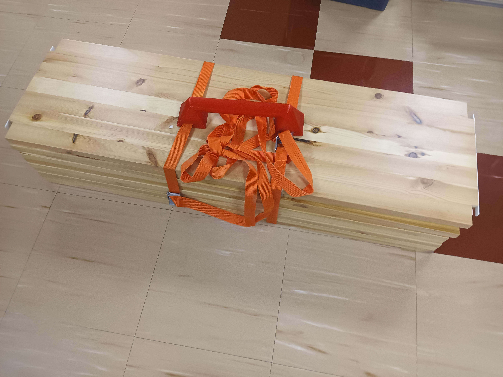

# Various open source physical objects by Heikki Suonsivu

These are licensed, unless otherwise stated in program files or included license text,
under [Creative Commons CC-BY-NC-SA](https://creativecommons.org/licenses/by-nc-sa/4.0/).

I mostly use OpenSCAD for modeling, it will export STL. As I use
hull() a lot, these might be difficult to import to other cad
programs. Some of the models are really slow in OpenSCAD, so use F6
(or whatever in your computer) to render before changing viewing angle.

Please return improvements to me to be included in the
main distribution.

I usually try to avoid needing supports by making angles less than 50
degrees or overhangs small enough, so unless otherwise stated, you can
print without supports,if the object is rotated correctly in the slicer.

### canon-tripod-1-top.scad

I had old Canon tripod-1, and its rubbery top part disintegrated with
age. This is a replacement. Print with TPU.

### coasterholder3.scad

If you have a dead 5.25inch hard drive, you can recycle the disk
platters inside to make nice coasters for you bar. This is a holder
for coasters from a 8 platter Maxtor hard disk. Other hard disks might
need some adapting. See also "suklaarasiankansi.scad".

### disk525to35.scad

This is an adapter to put 3.5 inch disk drive to a 5.25 drive slot. It
is designed to not to need screws, however, with certain cases that
might not work well due to funky mechanisms to lock things in
place. Maybe fixed in a future versions to allow screws to be used for
outside attachments.

printing time on Tronxy X5SA/Pro 400 or Anycubic Chiron takes about 18
hours, and uses about 200g of filament. No supports are needed, rotate
so that locking sticks are on the bed, and on moving bed printers bed
moves in direction of locking sticks to avoid falling over.

To save filament printing time, default is to make the thing with
various cutouts.

Locking mechanism uses locking sticks, when pushed in, they push
knobs/keys into drive/case screw holes. For outer screw holes, you can
put the stick in upper or lower position, as computer cases might
differ for screw position.

If you enable simple version, there is no locking
mechanism, and the adapter only locks with springs. This does not
keep things in place very well.

Full height 3.5 inch drives will not fit as they are same height as
5.25 slot. Those are very rare anyway. Maybe this could be adapted by
removing top and bottom from disk position.

See options in the file.

### hammasharjateline.scad

Organizer for various things in the bathroom. Very specific, so not
very usable unless you use exactly same electric toothbrush and shaver
as me.

### license.scad

The default license file.

### lidllaturiteline.scad

Lidl sells wireless phone charger for two phones. It is not very
practical as the mobile phones need to be placed accurately to the
correct position. This holder allows simply dropping the two phones to
the slots, and they will start charging.

This was designed for my Blackview phones. Unfortunately, many phones
seem to have the induction loop at different position. For example,
some phones need to be upside down. It is relatively easy to tune for
various phones, the settings are in top of the files, hopefully
self-explanatory.

### kasvikyltit.scad

Bunch of veggie labels for your garden. You can modify the names at
the start of the file. Need to change number of labels if adding or
removing. You can have several labels printed in one go, but you must
put names in order of longest text to shortest text, I was too lazy to
fix the related bug.

I have printed these with light colour at bottom and top, and black in
the middle layers to make text more visible.

### nimikyltit.scad

Bunch of name labels labels. These we designed to be put on top of
rack for towels. You can modify the names at the start of the
file. Need to change number of labels if adding or removing. You can
have several labels printed in one go. You also need to configure the
size of your printer print area, as it arrange labels automatically.

I have printed these with black at the bottom and lighter color on top
to make text more visible.

### lundiacarrier.scad

Carrying multiple lundia shelf plates is difficult as they tend to
slide over each other. So I made a handle. You need to add two locking
straps ([such
as](https://www.tokmanni.fi/kiinnityshihna-pikalukko-25-mm-2-5-m-2-kpl-6419860608952)). This
is likely useful to carry other stuff as well.

### mittatesti.scad

Calibration tool to measure x,y and z axis. Some printers such as my
Tronxy need x/y axis movements to be calibrated. You can tune Number
of cubes and whether filament- and time-saving holes are printed.
For filaments which tend to warp and deform, this does not work very
well. Use PLA.

### paperiteline.scad

Holder for paper towel rolls. Left and right parts can be printed at
the same time if your printer is large enough. Left and right parts
lock into each other, but currently the mechanism leaves room for
improvement. Slight push releases the "fingers" holding the right
side.

### plantsupport.scad

One of our office plants was about to collapse and needed
support. This is very specific to size of planter and plant.

### presshandle.scad

I built a press for large engineering drawings to iron them
out. Basically it is a table with another table plate on top with
hinges. This is a handle for it. Might be useful for some other
application as well.

### sinisentuolinjalka.scad

One of the chairs in our office was missing a plug in one of its
feet. This is a replacement. Print with TPU. The chair does not have
any label in it so I do not know what brand or type it is.

### suklaarasiankansi.scad

You can turn your dead 5.25 inch hard disk to a stylish chocolate
box. This is for Maxtor 8 platter drive. Unfortunately, this model
does not work with any other disk model, so you need to find a dead
Maxtor IT-1140 drive.

### termostaatin-piuhapidike.scad

I needed a holder for smart zigbee thermostat for programming in
batch, so a small holder was needed. Not really useful for anything
else.

### vasara.scad

(Project stalled) Thought I needed electric hammer, so started
designing one but found a commercially available product so this project
stalled early. Maybe some day...

### sipulinistutin.scad

I needed to plant some seeds and onions, and wanted a tool for the job
to avoid stressing my back. This attaches to 25mm diameter metal
tube. When planting stuff, drop seeds from top of the tube while
pulling the sharp edge to open a narrow dig so that the seeds drop to
bottom of it. You need to maintain constant speed and drop seeds at
steady intervals. Or just keep pouring them while pulling
quickly. After planting a row, turn 90 degrees and cover the dig.

### kynnyskulma.scad

If you need to roll heavy wheeled items over a doorstep, this will
help a bit. It will split the part to multiple parets which attach to
each other, so you need to configure your printer width. For small
printers, you can print the parts in vertical configuration, but they
are more difficult to attach to each other. For heavy items, you might
want to up infill % from defaults. You can do a small test print to
test attachments.

### masklock.scad

A CPAP mask lock replacement. Needs supports, works best with tree
supports.

